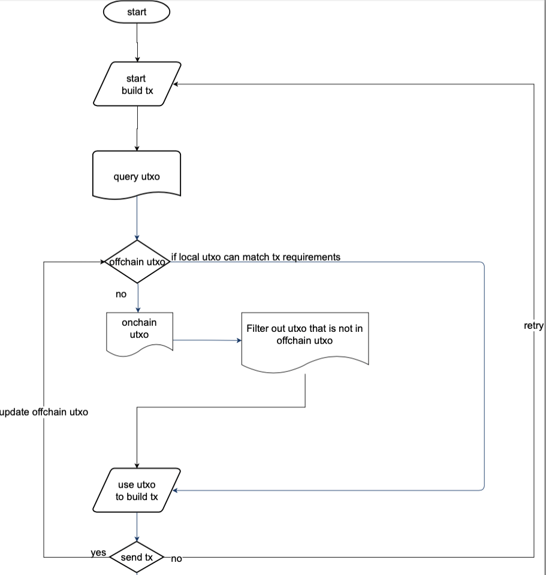

# CIP Cardano Multichain Router

# Abstract

This CIP proposes an implementation to integrate Multichain router protocol to Cardano chain. 

# Motivation

The motivation is to connect Cardano native crypto assets to Dapps on other chains and bring native crypto assets on other chains to Cardano ecosystem. Basically, connecting Cardano ecosystem with other ecosystem.

# Background

## Introduction to Multichain

Multichain is the ultimate Router for web3. It is an infrastructure developed for arbitrary cross-chain interactions.

Multichain was born as Anyswap on the 20th July 2020 to service the clear needs of different and diverse blockchains to communicate with each other. Each blockchain has its own unique mission, its own community and its own development ecosystem. For our industry to reach the next level for consumers, we need a fast, secure, inexpensive and reliable way to exchange value, data and exercise control between the chains.

The solutions developed by Multichain allow almost all blockchains to inter-operate. There is no restriction to Ethereum like chains (e.g. Binance Smart Chain), or different Layer 2 chains requiring finality to Ethereum (e.g. Polygon), or a network of Parachains (e.g. Moonbeam in the PolkaDot system), or Bitcoin types of chain (e.g. Litecoin), or COSMOS chains (e.g. Terra). These are either now all integrated, or on course for integration. With support for all ECDSA and EdDSA encrypted chains, Multichain is almost universally applicable as an interoperable layer.

Multichain is now the leader in the cross-chain field, with a rapidly expanding family of chains (currently 61) and daily volumes well in excess of $70 million ([https://](https://anyswap.net/)scan.multichain.org). Its sustained daily volume of more than $100 million, its Total Value Locked in excess of $5 billion and its thousands of daily users are testament to its popularity and security.

We take pride that we are an open source protocol([https://github.com/anyswap](https://github.com/anyswap)). Indeed to be properly described as decentralized as we are, it is essential to be open source, since otherwise how would anyone know that this was the case? We also have a strong belief in the principle of trustlessness. Anyone can use our crosschain services. They are controlled by code and there are no Externally Owned Addresses acting as a weak link.

## ****SMPC Network****

[https://github.com/anyswap/FastMulThreshold-DSA](https://github.com/anyswap/FastMulThreshold-DSA)

SMPC nodes exist separately from any blockchain and collectively sign transactions, but a group of them must do so together and they each only ever know a shard of the key to make this happen. The SMPC nodes are run by different organizations, institutions and individuals and they are incentivized to perform their functions properly.

Multi-party threshold ECDSA (elliptic curve digital signature algorithm) based on [GG20: One Round Threshold ECDSA with Identifiable Abort](https://eprint.iacr.org/2020/540.pdf) and EdDSA (Edwards curve digital signature algorithm),including the implementation of approval list connected with upper layer business logic and channel broadcasting based on P2P protocol.

It includes three main functions:

(1) Key generation is used to create secret sharing ("keygen") without trusted dealers.

(2) Use secret sharing, Paillier encryption and decryption to generate a signature ("signing").

(3) Preprocessing data before generating signature.(“pre-sign”).

When issuing the keygen/signing request command, there are two modes to choose from:

(1) Each participant node needs to approve the request command with its own account.It will first get the request command from the local approval list, and then approve or disagree.

(2) Each participant node does not need to approve the request command, which is agreed by default.

The SMPC network is responsible for signing transactions on each supported blockchain to perform a multitude of tasks comprising the management of asset accounts and smart contracts. A Threshold, will be needed to sign the transaction. This Threshold Signature (TSS) is denoted as (t, n), such as (9,15), (15,21), (21,31) etc., where t is the number of nodes needed to sign, and n is the total number of nodes in the set.

## Router

Cardano will be integrated with Multichain router V3, which was lauched on June 4th 2021. The Router can allow assets to be transferred among all others connected chains including Cardano. Check more about router here:

[https://docs.multichain.org/getting-started/how-it-works/cross-chain-router](https://docs.multichain.org/getting-started/how-it-works/cross-chain-router)

# User Cases

Tokens on different chains can be bridged to Cardano, but let’s simplify it to the scenario between Ethereum and Cardano.

On Cardano side, the Multichan SMPC nodes manage a MPC address, which locks the Cardano native tokens bridged to Ethereum and mint the wrapped tokens bridged from Ethereum.

On Ethereum side, the Multichain SMPC nodes will call Multichain router smart contract to send the Ethereum native token in the pool to users and mint the wrapped tokens bridged from Cardano. 

## A. ****Bridging Ethereum native tokens from Ethereum to Cardano****

1, User send USDC to the USDC pool on Ethereum and indicate the receiving address on Cardano.

2, The SMPC nodes verify the user transaction on Ethereum independently.

3, After the verification, the SMPC nodes work together to sign a minting transaction on Cardano.

4, The SMPC nodes mint wrapped USDC to user’s address on Cardano. 

## B. Bridging wrapped Ethereum native token from Cardano to Ethereum

1, User send wrapped USDC to the SMPC address on Cardano and indicate the receiving address on Ethereum.

2, The SMPC nodes verify the user transacton on Cardano independently.

3, After the verification, the SMPC nodes work together to sign a transfer transaction on Ethereum.

4, The SMPC nodes send the native USDC to user’s address on Ethereum. 

## C. Bridging Cardano native token from Cardano to Ethereum

1, User send native ADA to the SMPC address on Cardano and indicate the receiving address on Ethereum.

2, The  SMPC nodes verify the user transaction on Cardano independently.

3, After the verification, the SMPC nodes work together to sign a minting transaction on Ethereum.

4, The SMPC nodes mint wrapped ADA to user’s address on Ethereum.

## D. Bridging wrapped Cardano native token from Ethereum to Cardano

1, User send wrapped ADA to the wrapped ADA pool on Ethereum and indicate the receiving address on Cardano.

2, The SMPC nodes verify the user transaction on Ethereum independently.

3, After the verification, the SMPC nodes work together to sign a transfer transaction on Cardano.

4, The SMPC nodes send the native ADA to user’s address on Cardano.

# Specification

## Major Modules

### SwapOut transaction

Cardano: Transfer to SMPC address with metadata indicating key/value:

```json
{
    "metadata": {
        "key": "123",
        "value": {
            "bind": "target address",
            "toChainId": 1
        }
    }
}
```

Ethereum: Smart Contract call with log: LogAnySwapOut

```solidity
function anySwapOut(address token, string memory to, uint amount, uint toChainID) external;
event LogAnySwapOut(address indexed token, address indexed from, string to, uint amount, uint fromChainID, uint toChainID);
```

### Transaction Registry

Cardano: Verify metadata and receiving address

```solidity
1, Verify the safe block height of the transaction.
2, Verify the metadata has dedicated key and value is bind：toChainId.
3, Verify the token in the transaction is in the supported list.
4, Check the amount received by MPC address.
5, Check the amount is in the legitimate range. 
```

Ethereum: Verify the LogAnySwapOut log

```solidity
1, Verify the safe block height of the transaction.
2, Verify that router contract isseued the LogAnySwapOut log.
3, Verify the token in the transaction is in the supported list.
4, Check the amount received in the pool.
5, Check the amount is in the legitimate range. 
```

### Building Transaction

Get elements of the transaction

1, Get bindAddr as the receiving address

2, Get toChainId  as the destination blockchian

3, Get bridging amount: value

4, Get the conversion data from config smart contract, such as decimal, fees etc.

5, Calculate the amount based on these information.

```solidity
Suppose the elements: value：11111111（the decimal on source chain is:6）  fee:111111000000000000(default decimal of fee is:18), the decimal of destination:18
1. Change the decimal of fee from 18 to the decimal onn source chian，18->6
	fee:111111000000000000->111111
2. leftValue= value-fee = 11111111-111111=11000000 (the amount send to user on ddestination chain)
3. Change the decimal of leftValue to the decimal of destination chain. 6->18
	amount: 11000000->11000000000000000000 
```

6, Build transaction with bindAddr, toChainId and amount.

Get UTXO as input

```solidity
1, Get the local cashed map UTXO. If the balance is enough, use it as the input of the new transaction.
2, If the balance is not enough, get the latest onchain UTXO and combine all the UTXO as the input of the new transaction.
```

Transaction for wrapped token on Cardano:

```solidity
	cardano-cli transaction build-raw \
	--tx-in txHash#0 \
	--tx-in ...\
	--tx-out $(reveiverAddr)+1500000+"targetToken amount" \
	--tx-out $(mpcAddr)+xxxx+... \
	--mint ...\
  --mint-script-file ...\
	--fee 0 \
	--out-file tx.draft
```

Transaction for native token on Cardano:

```solidity
	cardano-cli transaction build-raw \
	--tx-in txHash#0 \
	--tx-in ...\
	--tx-out $(reveiverAddr)+1500000+"targetToken amount" \
	--tx-out $(mpcAddr)+xxxx+... \
	--fee 0 \
	--out-file tx.draft
```

Call the Swapin ABI of Router contract

```solidity
function anySwapIn(bytes32 txs, address token, address to, uint amount, uint fromChainID) external onlyMPC
```

### Sign request to SMPC nodes

```solidity
Send the transaction to SMPC nodes to sign.
```

### Send signed transaction to Cardano

```solidity
1, Get the RSV from MPC network
2, Build the signed transaction
3, Send the signed transaction to RPC.
4, Update the local cached map, with latest UTXO and amount
```

## Rationale

### Minting policy

The minting policy in the Cardano integration is the same as that in other integration. 1:1 Pegging minting. The Multichain protocol only mint the wrapped tokens as much as the locked native tokens. 

### Token Metadata

There is no onchain token metadata. All the wrapped token needs to be registered in the github repo with information such as decimal.

[https://github.com/cardano-foundation/cardano-token-registry](https://github.com/cardano-foundation/cardano-token-registry)

All minted token on Cardano share the same currency symbol or policy ID, but with different token names. 

[https://github.com/input-output-hk/cardano-node/blob/master/doc/reference/multi-assets.md](https://github.com/input-output-hk/cardano-node/blob/master/doc/reference/multi-assets.md)

### Decimal

Because the value of token in Cardano is limited to int 64, we need to consider the decimal convert in the 3 categories.

a, If the total supply can be expressed by int 64 with the decimal of the token on source chain. Or the total supply of the token below 9,223,372,036,854,775,807. The wrapped tokens on Cardano will keep the decimal as native token. 

```json
{
    "eth": {
        "totalSupply": "1000000000000000000",
        "decimals": 18
    },
    "cardano": {
        "totalSupply": "1000000000000000000",
        "decimals": 18
    }
}

eth->cardano: 1111111>1111111
cardano->eth: 1111111>1111111
```

b, If the total supply can not be expressed by int 64 with the decimal of the token on source chain, the decimal on Cardano side will be set as 6. The Multichain protocol will convert the decimal. 

```json
{
    "eth": {
        "totalSupply": "1000000000000000000000000",
        "decimals": 18
    },
    "cardano": {
        "totalSupply": "1000000000000",
        "decimals": 6
    }
}
eth->cardano: 1111111111111>1
cardano->eth: 1>1000000000000
```

c, If the int 64 with 6 decimal still can’t express the total supply of the token, the decimal on Cardano side will be set as 0. The Multichain protocol will convert the decimal. 

```json
{
    "eth": {
        "totalSupply": "100000000000000000000000000000000",
        "decimals": 18
    },
    "cardano": {
        "totalSupply": "100000000000000",
        "decimals": 0
    }
}
eth->cardano: 1111111111111111111>1
cardano->eth: 1>1000000000000000000
```

This consideration is to include the extreme situation that one transaction may bridge the amount of the total supply. Since this adjust the precision of the bridged amount, this need to be agreed by the token project team.

### Minimum ADA for every UTXO

On Cardano, every UTXO must contain a minimal amount of ADA. After evaluation, extra fee equivalent to 2 ADA will be added to the base fee for every transaction from other chains to Cardano.

For example. User send 1000 USDC from Ethereum to Cardano. The base fee is 0.1%, which is 1 USDC. The extra fee is 0.9USDC, which is equivalent to 2 ADA. The total fee is 1.9USDC. The user will receive 998.1USDC and 2 ADA on Cardano. The extra fee will adjust according to the ADA price fluctuation. 

To ensure there is enough ADA on SMPC address to send transaction to users, the ADA balance on SMPC address needed to be monitored by Gas Fee Monitor Mechanism, which is monitoring the gas fees on all the SMPC addresses sending asset or calling smart contracts on chains.

Minimum bridging amount will be set, bridging amount below the transaction will be ignored by Multichain protocol.

### Concurrency

 Multichain protocol use transactions chaining on Cardano to improve the concurrency. 

### Burning the wrapped token on Cardano

If the balance of the swapin token on SMPC address is enough, the SMPC nodes will transfer the the needed amount.

If the balance is not enough, the SMPC nodes will mint the lacking amount.

When users bridged wrapped token on Cardano from Cardano to Ethereum, the wrapped tokens will be locked on the MPC address. A independent thread periodically burn the tokens locked on MPC address every week. 

### Configuraton

All the configuration is stored on a onchian smart contract.

```json
// key is chainID
mapping(uint256 => ChainConfig) _chainConfig;

// key is tokenID,chainID
mapping(string => mapping(uint256 => TokenConfig)) _tokenConfig; 

// key is tokenID,srcChainID,dstChainID
mapping(string => mapping(uint256 => mapping(uint256 => SwapConfig))) _swapConfig; 
 
// key is tokenID,srcChainID,dstChainID
mapping(string => mapping(uint256 => mapping(uint256 => FeeConfig))) _feeConfig;

struct ChainConfig {
        string BlockChain;
        string RouterContract;
        uint64 Confirmations;
        uint64 InitialHeight;
        string Extra;
    }

struct TokenConfig {
        uint8 Decimals;
        string ContractAddress;
        uint256 ContractVersion;
        string RouterContract;
        string Extra;
    }

struct SwapConfig {
        uint256 MaximumSwap;
        uint256 MinimumSwap;
        uint256 BigValueThreshold;
    }

struct FeeConfig {
        uint256 MaximumSwapFee;
        uint256 MinimumSwapFee;
        uint256 SwapFeeRatePerMillion;
    }

```

# Codebase Guide

## Major Module

- [Transaction Register](https://github.com/anyswap/CrossChain-Router/blob/75f2953e496ca02b3d92b8eeb31df54b0f35ae7a/tokens/cardano/register.go#L23) RegisterSwap
- [Transaction Build](https://github.com/anyswap/CrossChain-Router/blob/75f2953e496ca02b3d92b8eeb31df54b0f35ae7a/tokens/cardano/buildtx.go#L20) BuildRawTransaction
- [MPC Sign](https://github.com/anyswap/CrossChain-Router/blob/75f2953e496ca02b3d92b8eeb31df54b0f35ae7a/tokens/cardano/signtx.go#L23) MPCSignTransaction

## Functions

- [Query Transaction](https://github.com/anyswap/CrossChain-Router/blob/75f2953e496ca02b3d92b8eeb31df54b0f35ae7a/tokens/cardano/verifytx.go#L96) getTxOutputs
- [Fees/Decimal Process](https://github.com/anyswap/CrossChain-Router/blob/75f2953e496ca02b3d92b8eeb31df54b0f35ae7a/tokens/base.go#L232) CheckTokenSwapValue
- [Selecting UTXO](https://github.com/anyswap/CrossChain-Router/blob/75f2953e496ca02b3d92b8eeb31df54b0f35ae7a/tokens/cardano/buildtx.go#L292) BuildTx
- [Cardano-CLI](https://github.com/anyswap/CrossChain-Router/blob/75f2953e496ca02b3d92b8eeb31df54b0f35ae7a/tokens/cardano/cardanoCmd.go#L42) ExecCmd

# Flow Charts

[How offchain cached utxo work.pdf](CIP%20Cardano%20Multichain%20Router%20b02eb0e3a2bf408a85bdbe6a4ce5603b/How_offchain_cached_utxo_work.pdf)

[cardano_-_eth Flow Chart.pdf](CIP%20Cardano%20Multichain%20Router%20b02eb0e3a2bf408a85bdbe6a4ce5603b/cardano_-_eth.pdf)



[CIP%20Cardano%20Multichain%20Router%20b02eb0e3a2bf408a85bdbe6a4ce5603b/cardano_-_eth%201.pdf](CIP%20Cardano%20Multichain%20Router%20b02eb0e3a2bf408a85bdbe6a4ce5603b/cardano_-_eth%201.pdf)